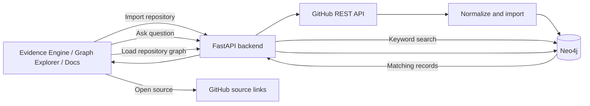

# CodeInsight Project Guide

**Project name:** *Why The Code Is Like This*  
**Innovation theme:** AI and Developer Tools  
**Purpose of this document:** explain the current prototype, how its parts work together, how to run it, and what its output does and does not mean.

## 1. Project overview

CodeInsight is a web prototype for exploring the history of a **public GitHub repository**. It imports a bounded set of recent commits, merged pull requests (PRs), and issues into Neo4j. A developer can search those records with a question, inspect matching source links, and browse a sample of the repository graph.

The starting idea was an AI assistant that explains why code decisions were made, initially framed around FastAPI. The implemented project is more limited and evidence-focused: it finds records whose text matches question keywords. It does not generate an LLM explanation or establish historical intent.

## 2. What a user can do

The frontend has three pages:

- **Evidence Engine** (`prototype/frontend/index.html`): import a repository, ask a question, and inspect matching commits, PRs, and issues with GitHub links.
- **Graph Explorer** (`prototype/frontend/graph.html`): view a bounded, balanced sample of repository nodes and relationships. Click a node to inspect its metadata and source link.
- **Documentation** (`prototype/frontend/docs.html`): read the API reference and try supported requests. The health check confirms the FastAPI process responds; it does not check Neo4j.

The normal flow is:

1. Enter a public GitHub URL or `owner/repo`, such as `encode/httpx`.
2. The backend validates the repository and fetches recent public history.
3. The importer stores normalized records and relationships in Neo4j.
4. Ask a question with distinctive words likely to appear in the history.
5. Review the returned records and open their GitHub sources to judge whether they support an answer.
6. Open Graph Explorer to browse the imported repository’s graph sample.

## 3. How the system fits together



### Repository import

`prototype/backend/main.py` accepts an HTTPS GitHub repository URL or an `owner/repo` slug. It runs `fetch_github_data.py`, which calls GitHub’s REST API and creates normalized JSON in a temporary directory. The API then imports that data into Neo4j through `import_sample.py`; the temporary JSON file is not the persistent store.

The endpoint requests up to 20 recent commits, 10 merged PRs, and 15 issues. It also fetches commit details for up to 8 commits and up to 5 additional issues linked from PR closing text. GitHub may return fewer. Commits attached to the fetched PRs are included too, so the total commit count can exceed 20; the `encode/httpx` demonstration imported 36 commits.

Commit, PR, and issue text is bounded during ingestion. Stable IDs preserve repository ownership, and source URLs are retained so users can inspect original records.

### Graph model

The importer creates these node types:

- `Repository`
- `Commit`
- `PullRequest`
- `Issue`
- `Developer`
- `File`

It creates relationships such as:

- `Repository -[:HAS_COMMIT]-> Commit`
- `Repository -[:HAS_PULL_REQUEST]-> PullRequest`
- `Repository -[:HAS_ISSUE]-> Issue`
- `PullRequest -[:INCLUDES_COMMIT]-> Commit`
- `PullRequest -[:REFERENCES_ISSUE]-> Issue`
- `Commit -[:CHANGED]-> File`
- `Commit -[:AUTHORED_BY]-> Developer`

Repository-scoped IDs look like `owner/repo`, `owner/repo@<commit-sha>`, `owner/repo#<number>`, and `owner/repo:<file-path>`. These IDs let the graph endpoint select one repository rather than finding unrelated records by matching words in their titles.

Neo4j data is persistent. Repeated imports use stable IDs and `MERGE`, which reuses matching nodes and relationships and updates imported properties. Imports do not automatically delete older records that were not present in a later bounded fetch. The graph remains in Neo4j until that database data is cleared.

### Question retrieval

`prototype/backend/rag_pipeline.py` lowercases a question, extracts words, removes common stop words, and searches the text of `Commit`, `PullRequest`, and `Issue` nodes. Each distinct keyword found in a record’s searchable text adds one point. Results are ordered by score and date, then limited to 10.

The Evidence Engine sends the most recently imported repository along with the question. The API can also be called without a repository field, in which case it searches all imported repositories. The current frontend shows a count and matching source records; matching text is not proof of why a change was made.

No LLM is called in the active question path. LLM-related packages in `requirements.txt` do not mean runtime questions use a language model.

## 4. How to understand the graph

**Evidence Engine results and Graph Explorer have different scopes.** The Evidence Engine shows records matched by the current question. Graph Explorer shows a balanced sample of the imported repository history, not only the records matched by that question.

For the `encode/httpx` local import, the graph API returned 81 nodes: 1 repository, 36 commits, 10 PRs, 15 issues, 8 developers, and 11 files. The API returns at most 100 relationships. The visual page then chooses a smaller balanced sample; a recorded view showed 18 nodes and 16 relationships. Counts vary with the repository and sample selection.

The graph page groups node types into columns, orders the displayed sample consistently, colors relationships, and uses arrows to show direction. Its legend names the relationship types. On a narrow screen, scroll horizontally to see all columns. A node title such as `Commit 435e1da` is a short display label; click it to see the full record text and source link.

A graph may include a PR or issue that did not match the question. That is expected for a repository-wide topology view. A balanced sample is not the complete history or a question-specific evidence chain.

## 5. API reference

The backend exposes these main endpoints:

| Method and path | Purpose |
| --- | --- |
| `GET /` | Confirms the API responds. |
| `GET /health` | Confirms FastAPI is running; does not verify Neo4j. |
| `POST /api/repositories` | Fetches and imports bounded public repository history. |
| `POST /api/ask` | Returns up to 10 keyword-matched evidence records. Accepts `question` and optional `repository`. |
| `GET /api/graph?q=owner%2Frepo` | Returns up to 100 relationships and their endpoint nodes, scoped to one repository when `q` is provided. |

The API reference page has sample requests and responses. They are examples, not live query results.

## 6. Run the project locally

Requirements: Python 3.10 or newer, installed backend requirements, and a reachable Neo4j database with credentials.

### Configure Neo4j

Create `prototype/backend/.env` with your own values:

```text
NEO4J_URI=neo4j+s://your-instance.databases.neo4j.io
NEO4J_USERNAME=neo4j
NEO4J_PASSWORD=your-password
```

`GITHUB_TOKEN` is optional for public repositories. It may help if GitHub rate-limits unauthenticated requests. Keep `.env` private and out of Git. Run `prototype/backend/schema.cypher` in Neo4j Browser once to create uniqueness constraints.

### Start the backend

From the project root, in a PowerShell terminal:

```powershell
cd prototype\backend
python -m venv .venv
.\.venv\Scripts\Activate.ps1
python -m pip install -r requirements.txt
python -m uvicorn main:app --reload --port 8000
```

Keep this terminal running. Check `http://127.0.0.1:8000/health` for `{"status":"healthy"}`. That confirms the API process, not the database connection.

### Start the frontend

In a second terminal, from the project root:

```powershell
cd prototype\frontend
python -m http.server 5500
```

Open `http://127.0.0.1:5500/index.html`. On `localhost` or `127.0.0.1`, the Evidence Engine and Graph Explorer select the local API at port 8000. On the hosted site, they select the Render backend. The local API allows the frontend origins on port 5500.

If importing or graph loading fails, check the backend terminal output, the `/health` endpoint, and the Neo4j `.env` settings. A healthy response alone does not establish a working Neo4j connection.

## 7. Hosted deployment

The project uses two Render services:

- Frontend: [cohort-do0y.onrender.com](https://cohort-do0y.onrender.com)
- Backend: [repoinsight-qjj0.onrender.com](https://repoinsight-qjj0.onrender.com)

The frontend selects the Render API when served from the hosted domain. The backend needs Neo4j credentials configured in its Render environment. The public GitHub token is optional. With auto-deploy enabled, pushing changes to the connected GitHub branch triggers a Render deployment; confirm the deployment finishes successfully before checking the hosted app.

## 8. What has been demonstrated

The Build Log records a manual `encode/httpx` demonstration dated 2026-10-03:

- Import: 36 commits, 10 merged PRs, and 15 issues.
- Question: “What changed to support chardet 6.0?”
- Retrieval: 10 records, including relevant records and noise.
- Source check: one linked commit was opened and verified; it changed a response-decoding test to accept `ISO-8859-1` or `WINDOWS-1252`.
- One query run took 4.56 seconds; this is not a comparison with manual search.

The Build Log also documents two exploratory student sessions. One participant found the graph useful but assumed it covered all repository history; the other noticed irrelevant retrieval results. These small sessions do not establish general usability or retrieval accuracy.

The product hypothesis is that source-linked keyword results can help a developer find useful repository history faster than manual GitHub search; no timed comparison has established that. The intended user is a developer or open-source contributor investigating an unfamiliar public repository. Current substitutes include GitHub search, commit and PR pages, `git log`, `git blame`, and asking a maintainer. The Build Summary records a first-pass opportunity scenario using GitHub’s reported 180M+ developers, with assumed 1% fit and 0.1% reachable/adoptable rates: 1.8M possible-fit users and 1,800 early users. Those rates are assumptions, not measured demand; no revenue estimate is claimed.

## 9. Limits and next work

- Only public GitHub repositories are accepted; imports are bounded, not complete clones.
- The GitHub API can return fewer records, and unauthenticated requests can be rate-limited.
- Keyword matching can miss useful history and return unrelated matches.
- The graph API is capped at 100 relationships; the visual page displays a smaller sample.
- A graph relationship or keyword match does not prove a historical reason or causal connection.
- Manual source review is required. The project has not established that it is faster than GitHub search or that it improves outcomes for developers generally.
- Most failure cases in the Build Log test plan remain untested. Broader technical checks, stranger tests, and a timed comparison with manual GitHub search are the next evaluation steps.

The Build Log and Build Summary preserve the assessment process and evidence position. This guide explains the current working prototype and is supplementary to those submission documents.

## 10. Source file map

- `prototype/frontend/index.html`, `prototype/frontend/app.js`, `prototype/frontend/styles.css` — Evidence Engine and shared interaction styling.
- `prototype/frontend/graph.html` — Graph Explorer layout, sample selection, relationship colors, arrows, and node details.
- `prototype/frontend/docs.html` — interactive API reference page.
- `prototype/backend/main.py` — FastAPI routes, request validation, import orchestration, and graph API.
- `prototype/backend/fetch_github_data.py` — bounded GitHub REST API retrieval and normalization.
- `prototype/backend/import_sample.py` — Neo4j node and relationship import.
- `prototype/backend/rag_pipeline.py` — keyword extraction and evidence retrieval.
- `prototype/backend/schema.cypher` — uniqueness constraints.
- `prototype/backend/graph_retrieval.cypher` — a sample Cypher query for the bundled `pallets/click` data.
- `prototype/backend/INGESTION_CONTRACT.md` — normalized data fields and stable ID rules.
- `prototype/backend/data/pallets_click_final.json` — bundled normalized sample dataset for `pallets/click`; it is not the temporary JSON created for each API import.